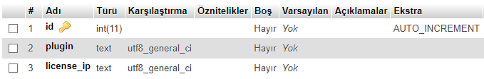

# license-web-api
Web API for license manager

Checks MySQL for is any license exists for provided values.

## Database Design Pattern

- id -> AUTO_INCREMENT int
- plugin -> text
- license_ip -> text

## Usage

- http://localhost/check.php?plugin={plugin}&ip={ip}

Returns status of ip and plugin with JSON format.

## Requirements:

- PHP 7.1+
- MySQL
- Database Table

## Useful Links

* [JavaLicense for license check for jars](https://github.com/poyrazinan/JavaLicense)
* [Discord Bot for licenses](https://github.com/poyrazinan/GeikPlugins-Discord-Bot)